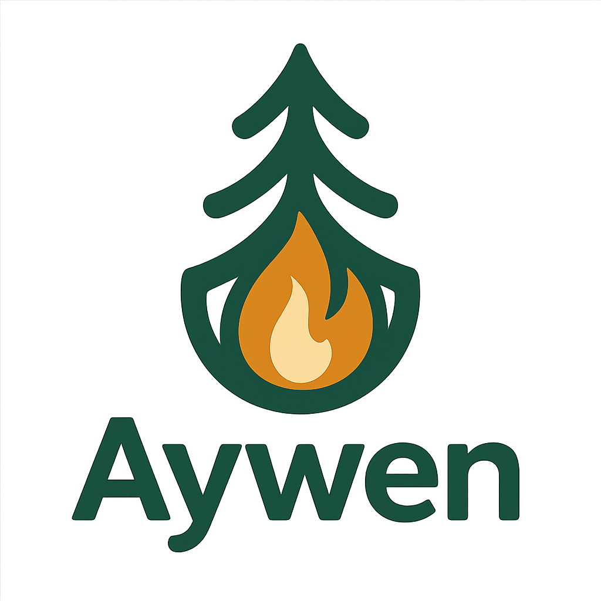

<h1 align="center">

</h1><br>

Aywen is a lightweight toolkit for preprocessing, validating, and feature‑engineering wildfire incident and dispatch datasets. It provides a reproducible pipeline to load multiple CSVs, normalize and match incidents with dispatches, and generate QA/QC artifacts. It also includes geospatial helpers to attach zone metadata from shapefiles.

## Requirements
- Python: >= 3.11
- Dependencies (installed automatically):
  - `pandas>=2.3.1`
  - `numpy>=2.3.2`
  - `geopandas>=1.1.1`
  
Note: As of version 0.1.0, `geopandas` is a required dependency and is installed by default.

## Installation

### Using pip (local repo)
Create and activate a virtual environment, then install in editable mode. All dependencies from `pyproject.toml` will be installed automatically.

**Windows/macOS/Linux (PowerShell/bash):**
```bash
# Clone repo and go to development branch
git clone https://github.com/RNS-ago/aywen.git
cd aywen
git checkout development

# Upgrade pip and install package on current active environment
pip install -U pip
pip install .
```

### Using pip (For development)
Create and activate a virtual environment, then install in editable mode. All dependencies from `pyproject.toml` will be installed automatically.

**macOS/Linux (bash):**
```bash
python -m venv .venv
source .venv/bin/activate

# Clone repo and go to development branch
git clone https://github.com/RNS-ago/aywen.git
cd aywen
git checkout development

# Upgrade pip and install package on current active environment
pip install -U pip
pip install -e .
```

**Windows (PowerShell):**
```powershell
python -m venv .venv
source .venv/bin/activate

# Clone repo and go to development branch
git clone https://github.com/RNS-ago/aywen.git
cd aywen
git checkout development

# Upgrade pip and install package on current active environment
pip install -U pip
pip install -e .
```


### Using uv (For developemnt)
This project includes a `uv.lock` for reproducible environments.

**macOS/Linux (bash):**
```bash
# Clone repo and go to development branch
git clone https://github.com/RNS-ago/aywen.git
cd aywen
git checkout development

# Create and activate a virtualenv managed by uv
uv venv
source .venv/bin/activate    # Windows: .venv\Scripts\Activate.ps1

# Sync dependencies from pyproject/uv.lock
uv sync

# Alternatively, perform an editable install
uv pip install -e .
```

**Windows (PowerShell):**
```powershell
# Clone repo and go to development branch
git clone https://github.com/RNS-ago/aywen.git
cd aywen
git checkout development

# Create and activate a virtualenv managed by uv
uv venv
.venv\Scripts\Activate.ps1

# Sync dependencies from pyproject/uv.lock
uv sync

# Alternatively, perform an editable install
uv pip install -e .
```


## Quick Start

### Preprocessing pipeline
Load multiple CSVs (incidents + dispatches), normalize columns, standardize IDs, match, and generate QA/QC outputs.

```python
from aywen.preprocessing import preprocess_pipeline

fire_csvs = [
    "data/incendios_2019.csv",
    "data/incendios_2020.csv",
]
dispatch_csvs = [
    "data/despachos_2019.csv",
    "data/despachos_2020.csv",
]

fire_df, dispatch_df, qaqc_df = preprocess_pipeline(
    fire_csvs,
    dispatch_csvs,
    output_dir="out",  # optional, saves CSVs
)
```

### Geospatial features
Attach zone labels from a shapefile to rows with lat/lon.

```python
from aywen.features import add_zones_to_df, split_zones, get_zones

# Get a dictionary of zones for the coordinates
zones = get_zones(
    coords = (-33.4489, -70.6693),
    shapefile_path="data/zones.shp",
    crs: str = "EPSG:4326",
    lon_col="longitude",
    lat_col="latitude",
    zone_col="area",
    new_zone_col="zone_alert",
    )


# Add zone labels to fire incidents
gdf = add_zones_to_df(
    df=fire_df,
    shapefile_path="data/zones.shp",
    crs: str = "EPSG:4326",
    lon_col="longitude",
    lat_col="latitude",
    zone_col="area",
    new_zone_col="zone_alert",
)

splited_gdf = split_zones(
    df = gdf,
    zone_col = "zone_alert",
    separation_keys = ["zone_WE", "zone_NS"]
    )

```

### Logging functionality
Logging is integrated throughout the pipeline to provide insights into the processing steps. The logging level can be adjusted in the configuration.

To enable the built in logging functionality run the following commands before you run any function from the library.
```python
import logging
from aywen.logging_setup import configure_logging

# Set up logging to aywens logging config
configure_logging()

# Set the logging level for the aywen_logger, this case DEBUG
logging.getLogger("aywen_logger").setLevel(logging.DEBUG)
```

## Notes
- Expected columns referenced by helpers (e.g., `hr_arribo`, `glosa`, `recurso`, `fire_id`, `arrival_datetime_inc`) are standardized inside the pipeline; see `src/aywen/preprocessing.py` and `src/aywen/features.py` for details.
- Logging is preconfigured with colorized console output; see `src/aywen/logging_setup.py`.

## Development
- Versioning and dependencies are defined in `pyproject.toml`. Use `uv sync` for a deterministic environment (via `uv.lock`), or `pip install -e .` for editable development.
- Contributions welcome. Please open an issue or PR with a clear description and minimal reproducible example.
